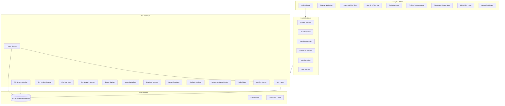

# Ableton Hub - Agent Knowledge Base

One-stop reference for AI agents working on this codebase. Read this before making edits to avoid wrong assumptions and maintain consistency.

---

## 1. Quick Reference Card

| Item | Value |
|------|-------|
| **Tech stack** | Python 3.11+, PyQt6 6.6+, SQLAlchemy 2.0+, SQLite with FTS5 |
| **Entry point** | `src/main.py` → `main()` |
| **App setup** | `src/app.py` → `AbletonHubApp` |
| **Config** | Dataclasses in `src/config.py`; JSON persistence via `ConfigManager` |
| **Database** | `src/database/models.py`, `db.py`, `migrations.py` |
| **Run command** | `python -m src.main` or `ableton-hub` (when installed) |
| **Windows app data** | Config & DB: `%APPDATA%\AbletonHub\`; Logs: `%APPDATA%\AbletonHub\logs\` |

**CRITICAL conventions:**
- SQLAlchemy JSON columns: assign Python `list`/`dict` directly, **never** `json.dumps()`
- Paths: use `normalize_path()` for DB storage, `get_resources_path()` for assets
- Workers: use `BaseWorker` or `QThread`; never block UI thread

---

## 2. Architecture Overview

### Layered Architecture



### Layer Responsibilities

- **UI Layer:** PyQt6 widgets, dialogs, managers (MenuBarManager, ToolBarManager, ViewManager)
- **Controller Layer:** ProjectController, ScanController, LocationController, CollectionController, ViewController, LiveController
- **Service Layer:** Scanner, Watcher, ALSParser, ExportTracker, SimilarityAnalyzer, etc.
- **Data Layer:** SQLAlchemy models, repositories, migrations
- **Utils:** `paths`, `logging`, `fuzzy_match`

### Data Flow

- UI → Controllers → Services → Database
- Scanner/Watcher → Database (background, via workers)

---

## 2b. Critical Database Structure

### Tables and Relationships

| Table | Purpose | Key FKs |
|-------|---------|---------|
| `locations` | Project folder roots | — |
| `projects` | .als files, metadata | `location_id` → locations |
| `tags` | Tag definitions | — |
| `project_tags` | Project↔Tag M:N | `project_id`, `tag_id` |
| `collections` | Albums, EPs, smart collections | — |
| `project_collections` | Project↔Collection M:N, track order | `project_id`, `collection_id`, `export_id` |
| `exports` | Exported audio files | `project_id` → projects |
| `live_installations` | Ableton Live executables | — |
| `link_devices` | Ableton Link network devices | — |
| `app_settings` | Key-value app settings | — |
| `schema_version` | Migration tracking | — |

### Project Table — Critical JSON Columns (assign lists/dicts directly)

- `plugins`, `devices`, `sample_references`, `timeline_markers`, `export_filenames` — assign Python lists directly, never `json.dumps()`
- `feature_vector` — exception: scanner uses `json.dumps()` for the float list; model has `get_feature_vector_list()` for reading
- `tags` — DEPRECATED; use `project_tags` junction table

### FTS5 Virtual Table

- `projects_fts` — full-text search on name, export_song_name, notes, tags, plugins, devices
- Triggers keep it in sync; use `search_projects_fts()` in `db.py`

### Cascades

- `Project.location_id` → SET NULL on delete
- `ProjectTag`, `ProjectCollection` → CASCADE on delete
- `Export.project_id` → SET NULL on delete

---

## 2c. Threading and GUI Structure (Avoid Adding Problems)

### Rule: Never Block the UI Thread

All file I/O, DB writes, ALS parsing, ML computation, and network calls must run in a worker. The main thread runs the Qt event loop only.

### Worker Patterns

**QThread subclass** (run logic in `run()`):
- `ScanWorker`, `GlobalScanWorker`, `ProjectRescanWorker` (scanner, scan_controller)
- `ExportScanner`, `LinkScanWorker`, `AudioScanWorker`
- Create thread, call `start()`, connect `finished` signal
- For cancellation: implement `stop()` that sets `_stop_requested`; check in loop

**BaseWorker + moveToThread** (worker is QObject, lives on thread):
- `SimilarProjectsWorker`, `BackupScanWorker`
- Create worker **without parent**, create QThread, `worker.moveToThread(thread)`, connect signals, `thread.start()`
- Keep Python reference to QThread until it finishes (otherwise GC can destroy it → crash)

### Thread Cleanup Pattern (`_safely_stop_thread`)

1. Call `worker.cancel()` if it has that method
2. Disconnect all worker signals (prevents callbacks into stale UI)
3. Call `thread.quit()` — do NOT call `thread.wait()` (blocks UI)
4. Connect `thread.finished` → `thread.deleteLater()` and `worker.deleteLater()`
5. Append thread to `_orphaned_threads` list so Python keeps a reference

**Reference:** `src/ui/widgets/project_properties_view.py` lines 1047–1105

### View Switching and Worker Cancellation

When user navigates away from a view (e.g., Project Properties → Projects), the view must stop its workers. `MainWindow` calls `cleanup()` on views; views must implement `_stop_workers()` and call `_safely_stop_thread` for each worker.

### Signal/Slot Thread Safety

- Workers emit signals; slots run on the thread that owns the receiving object (usually main thread for UI)
- Qt automatically queues cross-thread signals — safe
- Never call UI methods (e.g., `setText`, `addItem`) from a worker; emit a signal instead

---

## 3. Critical Conventions and Assumptions

### 3.1 JSON Column Handling (CRITICAL - Prevents Double-Encoding Bug)

**Rule:** SQLAlchemy `JSON` columns store Python `list`/`dict` directly. **Never** use `json.dumps()` when assigning.

**Correct:**
```python
project.plugins = metadata.plugins or []
project.devices = metadata.devices or []
project.timeline_markers = metadata.timeline_markers or []
```

**Wrong:**
```python
project.plugins = json.dumps(metadata.plugins)  # Double-encodes; breaks Jaccard similarity
```

**Reading:** Use model helpers (`get_plugins_list()`, `get_devices_list()`, `get_timeline_markers_list()`, etc.) which handle both legacy string and list.

**Reference:** `src/services/scanner.py` lines 304-306; `src/services/watcher.py` line 420; `src/ui/controllers/scan_controller.py` (aligned)

### 3.2 Path Handling

- **Storage:** Use `normalize_path()` (forward slashes) for DB storage; `denormalize_path()` when reading
- **Resources:** Use `get_resources_path()` from `src/utils/paths.py` — works in dev and pip install
- **App data:** `get_app_data_dir()`, `get_database_path()`, `get_config_path()`, `get_thumbnail_cache_dir()` — platform-specific

### 3.3 Threading and Workers

**Pattern A:** `QThread` subclass (ScanWorker, GlobalScanWorker, ProjectRescanWorker, ExportScanner, LinkScanWorker) — run in `run()` method

**Pattern B:** `BaseWorker` (QObject) + `moveToThread(thread)` — used by SimilarProjectsWorker, BackupScanWorker

**Critical:** When using `moveToThread`, create worker **without parent**; keep Python reference to QThread to prevent GC destroying it before thread finishes.

**Cleanup:** Use `_safely_stop_thread()` pattern from `src/ui/widgets/project_properties_view.py` — request stop, don't block; track orphaned threads.

### 3.4 Database Conventions

- **Session:** Use `session_scope()` context manager or `get_session()`; always close
- **Migrations:** Add to `MIGRATIONS` list in `src/database/migrations.py`; use `PRAGMA table_info` to check column existence before `ALTER TABLE`
- **FTS5:** `projects_fts` virtual table; triggers keep it in sync; search via `search_projects_fts()`

### 3.5 Configuration

- **Dataclasses:** All config in `src/config.py` — WindowConfig, ScanConfig, ExportConfig, etc.
- **Persistence:** JSON file via `ConfigManager`; `get_config_manager()`, `save_config()`
- **Version:** Single source in `pyproject.toml`; `src/__init__.py` reads via `importlib.metadata` or fallback

---

## 4. Module Map (Where to Find What)

| Domain | Primary Modules | Notes |
|--------|-----------------|-------|
| Entry / App | `src/main.py`, `src/app.py` | App setup, logging, theme, DB init |
| Config | `src/config.py` | All config dataclasses |
| Database | `src/database/models.py`, `db.py`, `migrations.py`, `repositories/` | ORM, session, migrations |
| Scanning | `src/services/scanner.py`, `watcher.py` | Project discovery, file watching |
| ALS Parsing | `src/services/als_parser.py` | .als metadata extraction |
| Exports | `src/services/export_tracker.py`, `utils/fuzzy_match.py` | Export detection, matching; `AUDIO_EXTENSIONS` |
| Audio playback | `src/services/audio_player.py` | Singleton; WAV, MP3, FLAC, etc. |
| Find Audio Exports | `src/ui/widgets/find_audio_exports_view.py`, `src/ui/workers/audio_scan_worker.py` | Location-scoped export discovery and mapping |
| Similarity | `src/services/similarity_analyzer.py`, `ml_feature_extractor.py`, `ml_clustering.py` | Jaccard, cosine, ML |
| UI Main | `src/ui/main_window.py` | Central orchestration |
| Controllers | `src/ui/controllers/*.py` | Project, Scan, Location, Collection, View, Live |
| Managers | `src/ui/managers/*.py` | MenuBar, ToolBar, ViewManager |
| Workers | `src/ui/workers/base_worker.py`, `*_worker.py` | Background tasks; `AudioScanWorker` for recursive file scan |
| Dialogs | `src/ui/dialogs/*.py` | Modal dialogs |
| Widgets | `src/ui/widgets/*.py` | Reusable UI components |

---

## 5. Design Patterns in Use

- **Repository pattern:** `ProjectRepository`, `LocationRepository`, `CollectionRepository` — encapsulate queries
- **Controller pattern:** Controllers mediate between UI and services; emit signals
- **Manager pattern:** MenuBarManager, ToolBarManager, ViewManager — encapsulate UI subsystems
- **Worker pattern:** Background work in QThread or QObject+moveToThread; signals for progress/result
- **Lazy imports:** ML services (similarity_analyzer, ml_feature_extractor) defer numpy/sklearn until first use

---

## 6. Dependencies and Version Constraints

- **Core:** PyQt6>=6.6.0, SQLAlchemy>=2.0.0, Python>=3.11
- **Optional/lazy:** scikit-learn, numpy, pandas, librosa, soundfile (ML); lxml (ALS parsing)
- **Briefcase:** Separate `requires` for macOS vs Windows (ML deps on Windows; dawtool on both)
- **Ruff ignores:** E402, E712, E711, F401, N806, N803, N802, UP022, C401, I001, W293, W291 — see `pyproject.toml`

---

## 7. Common Pitfalls and "Do Not" List

- Do NOT use `json.dumps()` for SQLAlchemy JSON columns
- Do NOT block UI thread with long operations — use workers
- Do NOT create QThread worker with parent when using `moveToThread`
- Do NOT assume `.als` files are modified — read-only parsing only
- Do NOT add migrations without checking column existence (SQLite `ALTER TABLE` limitations)
- Do NOT use `== True` or `== None` in general Python, but SQLAlchemy filters require them (ruff E712, E711 ignored)

---

## 8. Testing and Validation (Windows)

Use PowerShell or Command Prompt — no bash/Linux commands.

- **Release validation:** `python tests/test_release.py --verbose` or `scripts\test_release.bat --verbose`
- **Skip code quality:** `python tests/test_release.py --skip-code-quality`
- **Skip ML tests:** `python tests/test_release.py --skip-ml`
- **Unit tests:** `pytest`; coverage: `pytest --cov=src --cov-report=html`
- **Formatting:** `black src tests` then `ruff check src tests --fix`

---

## 9. Development Info (from CONTRIBUTING, INSTALLATION)

### Version Management

- **Single source:** `pyproject.toml` → `[project]` → `version`
- **What's New:** `src/__init__.py` → `WHATS_NEW` dict, `get_whats_new_html()`
- To release: update both; About dialog reads from `__init__.py`

### Application Data Locations (Windows)

- Config & Database: `%APPDATA%\AbletonHub\` (e.g. `C:\Users\<user>\AppData\Roaming\AbletonHub\`)
- Logs: `%APPDATA%\AbletonHub\logs\`
- Thumbnail cache: `%LOCALAPPDATA%\AbletonHub\cache\` (or in app data per `paths.py`)

### .als File Parsing

- Read-only; never modify .als files
- Gzipped XML; parser extracts plugins, devices, tempo, key, arrangement length, timeline markers
- Handles Live 9.x–12.x; uses lxml if available, else stdlib
- `arrangement_length` = arrangement timeline clips only; `furthest_sample_end` = session clips
- Timeline markers via dawtool (external)

### Default Project Locations (Windows)

- `%USERPROFILE%\Documents\Ableton\`
- `%USERPROFILE%\Music\Ableton\`
- `%APPDATA%\Ableton\`
- `%USERPROFILE%\Documents\Ableton\User Library\`

### Data Privacy

- Local-only; no cloud sync or external network calls
- Read-only access to .als files

---

## 10. Adding New Views and Features

### View Registration Pattern

To add a new main-window view that replaces the content area:

1. Create the widget in `src/ui/widgets/` (e.g. `find_audio_exports_view.py`)
2. Add `VIEW_FOO = "foo"` constant to `ViewManager` in `src/ui/managers/view_manager.py`
3. In `MainWindow._create_central_widget()`: instantiate widget, add to `content_stack`, connect `back_requested` (or equivalent) to a handler
4. Register with `view_manager.register_view(ViewManager.VIEW_FOO, widget, index)`
5. Connect sidebar/panel signals to switch: `view_manager.switch_to_view(ViewManager.VIEW_FOO)`
6. Implement `cleanup()` on the view; call it from `MainWindow.cleanup()` and when navigating away in `_on_navigation_changed`
7. For "Back" behavior: emit `back_requested`; MainWindow switches to the appropriate prior view (e.g. Locations for Find Audio Exports)

### Context Menu Pattern

Multiple entry points can trigger the same action:

- **Sidebar:** `SidebarItem` has `item_type` ("location", "collection", etc.); add signals and handler in `_on_context_menu`; connect in `_load_locations` etc.
- **Panel tables:** `LocationPanel`, `CollectionView` — use `customContextMenuRequested`; get row/item at `itemAt(pos)`; add actions to `QMenu`; emit signals for MainWindow to handle.

### Backup Project Exclusion

Projects and exports in Backup folders are excluded throughout:

```python
from sqlalchemy import not_
query = query.filter(
    not_(Project.file_path.ilike("%/Backup/%")),
    not_(Project.file_path.ilike("%\\Backup\\%")),
)
```

Use `scanner._is_backup_file(path)` for path checks; exclude patterns: `**/Backup/**`, `**/Samples/**`, `**/.git/**`, `**/Ableton Project Info/**`.

### Exports and Audio

- **ExportTracker** (`src/services/export_tracker.py`): `add_export(path, project_id)`, `link_export_to_project(export_id, project_id)`; `AUDIO_EXTENSIONS` = `.wav`, `.mp3`, `.flac`, `.aiff`, `.aif`, `.ogg`, `.m4a`
- **AudioPlayer** (`src/services/audio_player.py`): Singleton via `AudioPlayer.instance()`; `play(path)`, `stop()`, `is_playing`, `current_file`; connect `playback_stopped`/`playback_finished` for UI updates
- **Export model:** `export_path` (unique), `project_id` (nullable); use `normalize_path()` for DB storage and comparison

### Path Exclusion Patterns

When scanning or listing files, exclude these paths (case-insensitive):

- Backup: `/Backup/`, `\Backup\`
- Samples: `/Samples/`, `\Samples\`
- Ableton: `/Ableton Project Info/`
- Version control: `/.git/`, `/node_modules/`
- Hidden: names starting with `.`

See `AudioScanWorker._is_excluded()` and `scanner._is_excluded()` in `src/services/scanner.py`.

### UI Styling

- Use `AbletonTheme.COLORS` from `src/ui/theme.py` for consistent colors
- `AbletonTheme.get_qcolor("accent")` for `QColor` in item foregrounds
- Avoid hover highlights on small action buttons (e.g. play) unless needed for affordance

---

## 11. External References

- `README.md` — user-facing features
- `CONTRIBUTING.md` — dev setup, architecture summary
- `docs/FEATURE_DEVELOPMENT.md` — implemented vs planned
- `docs/PLANNED_FEATURES.plan` — future roadmap
- `docs/INSTALLATION_WINDOWS.md` — Windows install and troubleshooting
