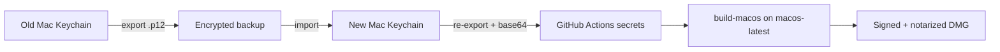

# Relocate Apple Developer ID Signing to a New Mac

Move the **Developer ID Application** certificate (and everything else GitHub Actions needs) from the current Mac to a new Mac, then re-wire this repo’s **Build Installers** workflow so macOS DMG signing and notarization still work.

Do this **before** wiping, selling, or stopping use of the old Mac. GitHub cannot show you the existing secret values, and the private key only lives in the old Mac’s keychain (plus any `.p12` backup you already made).

## How this repo signs the Mac app today

The workflow is `.github/workflows/build_installers.yml`.

| Job | Where it runs | How it signs |
|-----|----------------|--------------|
| `build-windows` | **Your Windows laptop** (self-hosted runner) | Certum SimplySign — see [WIN_BUILD_CODESIGN.md](WIN_BUILD_CODESIGN.md) |
| `build-macos` | **GitHub-hosted** `macos-latest` | Imports a `.p12` from GitHub secrets into a temporary keychain, signs with Briefcase, notarizes with `notarytool` |

The Mac job does **not** read a certificate file off your laptop. There is no `~/certs/...` path in the YAML. It always:

1. Base64-decodes `APP_CERT` into `$RUNNER_TEMP/certificate.p12`
2. Imports that PKCS#12 into a throwaway keychain (password = `APP_CERT_PASSWORD`)
3. Packages the DMG with `briefcase package macOS -p dmg --identity '<APP_IDENTITY>' --no-notarize`
4. Submits the DMG to Apple with `notarytool` using `APP_ID` + `APP_TEAM_ID` + `APP_PASSWORD`

**Relocating the cert** means: get the private key off the old Mac, import it on the new Mac, re-export a `.p12`, and put that blob back into GitHub secrets. After that, GHA keeps using GitHub-hosted macOS the same way — the “cert path” that matters for CI is the secret, not a folder on disk.

If you later want the Mac job to run on the new Mac (like Windows does on the laptop), see [Part 5](#part-5-optional--self-hosted-macos-runner-on-the-new-mac).



---

## What to save (inventory)

Copy this list into a password manager (or an encrypted disk image). **Do not commit any of it to git.**

### Must have (signing will fail without these)

| Item | What it looks like | Where it lives today | GitHub secret |
|------|--------------------|----------------------|---------------|
| Developer ID Application cert **+ private key** | PKCS#12 file, e.g. `AbletonHub-DeveloperID.p12` | Old Mac: Keychain Access → login → My Certificates | `APP_CERT` (file contents, **base64**) |
| `.p12` export password | Strong password you set at export | You chose it when exporting | `APP_CERT_PASSWORD` |
| Codesign identity string | `Developer ID Application: Your Name (TEAMID)` | `security find-identity -v -p codesigning` | `APP_IDENTITY` |
| Apple ID email | The Apple Developer account email | appleid.apple.com | `APP_ID` |
| Team ID | 10-character id, e.g. `A1B2C3D4E5` | [developer.apple.com/account](https://developer.apple.com/account) → Membership | `APP_TEAM_ID` |
| App-specific password | `xxxx-xxxx-xxxx-xxxx` | appleid.apple.com → Sign-In and Security → App-Specific Passwords | `APP_PASSWORD` |

`APP_CERT_PASSWORD` is also used in CI as the temporary keychain password. Keep it and the `.p12` password the same unless you change both the secret and how you export.

### Should save (makes the next Mac / renewal easier)

| Item | Why |
|------|-----|
| Exact identity string from the old Mac (screenshot or text) | Must match `APP_IDENTITY` character-for-character, including the Team ID in parentheses |
| Certificate expiry date | Developer ID certs expire; you will need to renew before then |
| Serial number of the cert | Confirms you imported the **same** cert, not an “Apple Development” or Mac App Store cert |
| This inventory (filled in, stored in the password manager) | GitHub secrets are write-only; you cannot read `APP_CERT` back out |

### Not required for this app

| Item | Why you can skip it |
|------|---------------------|
| Developer ID **Installer** certificate | This repo packages a **DMG**, not a signed `.pkg` installer |
| Mac App Store / “Apple Development” / “Apple Distribution” certs | Wrong product for Gatekeeper + notarized DMG |
| Provisioning profiles | Not used for Developer ID + Briefcase DMG |
| `.cer` only (no private key) | Useless for signing; you must have the `.p12` |

### Confirm you have the private key

On the **old Mac**, in Keychain Access, the cert must show a disclosure triangle. Expanding it must reveal a **private key**. If there is no private key, you cannot relocate this cert — go to [If you cannot export](#if-you-cannot-export--issue-a-new-certificate).

---

## Part 1: Record identity and account details (old Mac)

Work in **Terminal** on the old Mac. These values go into the inventory and later into GitHub secrets.

### 1A. Codesign identity (`APP_IDENTITY`)

```bash
security find-identity -v -p codesigning
```

You want a line like:

```text
1) AABBCCDDEEFF00112233445566778899AABBCCDD "Developer ID Application: Your Name (TEAMID)"
```

Copy the quoted string only, including `Developer ID Application:` and the `(TEAMID)`. That exact string is `APP_IDENTITY`.

Ignore identities named `Apple Development`, `Apple Distribution`, or `Mac Developer`. Those will not notarize a Developer ID DMG.

### 1B. Team ID (`APP_TEAM_ID`)

- Open [developer.apple.com/account](https://developer.apple.com/account)
- Membership details → **Team ID** (10 characters)

It must match the `(TEAMID)` at the end of `APP_IDENTITY`.

### 1C. Apple ID (`APP_ID`) and app-specific password (`APP_PASSWORD`)

These are **account** credentials, not machine-bound. They still work on the new Mac.

- `APP_ID` = the Apple ID email for the developer account
- `APP_PASSWORD` = an [app-specific password](https://appleid.apple.com) used by `notarytool` (not your real Apple ID password)

If you no longer have the app-specific password:

1. Go to [appleid.apple.com](https://appleid.apple.com) → Sign-In and Security → App-Specific Passwords
2. Revoke the old “notary” password if you are unsure which one CI uses (optional)
3. Create a new one, label it `Ableton Hub notarytool`
4. Save the `xxxx-xxxx-xxxx-xxxx` value as `APP_PASSWORD`

You can do this from any browser; you do not need the old Mac.

---

## Part 2: Export the certificate from the old Mac

You need a PKCS#12 (`.p12`) that contains **both** the Developer ID Application certificate and its private key.

### 2A. Export from Keychain Access (GUI)

1. Open **Keychain Access** (`/System/Library/CoreServices/Applications/Keychain Access.app`, or Spotlight)
2. Select **login** (or **Local Items**) in the sidebar
3. Category **My Certificates**
4. Find **Developer ID Application: Your Name (TEAMID)**
5. Confirm the private key is nested under it
6. Right-click the **certificate** (not only the key) → **Export “…”**
7. File format: **Personal Information Exchange (.p12)**
8. Save somewhere obvious, e.g. Desktop: `AbletonHub-DeveloperID.p12`
9. Set a strong export password. Write it down — this becomes `APP_CERT_PASSWORD`
10. macOS will ask for your **login password** to allow the private-key export. Allow it

If Export is greyed out or the format list has no `.p12`, the private key is not exportable. See [If you cannot export](#if-you-cannot-export--issue-a-new-certificate).

### 2B. Export from Terminal (alternative)

```bash
# List the Developer ID cert and confirm it has a key
security find-identity -v -p codesigning

# Export (you will be prompted for a passphrase — this is APP_CERT_PASSWORD)
security export -k login.keychain-db -t identities -f pkcs12 \
  -o "$HOME/Desktop/AbletonHub-DeveloperID.p12"
```

If that exports more identities than you want, use Keychain Access (2A) so you export only Developer ID Application.

### 2C. Copy the `.p12` off the old Mac immediately

Put `AbletonHub-DeveloperID.p12` **and** the export password in:

- A password manager attachment, **and/or**
- An encrypted disk image / encrypted USB you control

Then copy the `.p12` to the new Mac (AirDrop, USB, etc.). Do not email it unencrypted. Do not commit it. Do not leave it in iCloud Drive long-term.

### 2D. Optional: WWDR / Developer ID intermediate

Usually macOS downloads these automatically. If codesign later complains about an untrusted issuer, install Apple’s intermediates from [Apple PKI](https://www.apple.com/certificateauthority/):

- Developer ID - G2 (or current Developer ID CA)
- Apple Worldwide Developer Relations CA (G3 / current)

---

## Part 3: Import on the new Mac

### 3A. Xcode Command Line Tools

Signing and notarization need `codesign`, `security`, `notarytool`, and `stapler`:

```bash
xcode-select -p || xcode-select --install
xcrun notarytool --version
```

### 3B. Import the `.p12`

**GUI:** double-click `AbletonHub-DeveloperID.p12`, choose the **login** keychain, enter the export password.

**Terminal:**

```bash
security import "$HOME/Desktop/AbletonHub-DeveloperID.p12" \
  -k ~/Library/Keychains/login.keychain-db \
  -P "THE_P12_PASSWORD" \
  -T /usr/bin/codesign \
  -T /usr/bin/security
```

Replace `THE_P12_PASSWORD` with the export password (or omit `-P` and let `security` prompt).

Then allow codesign to use the key without an interactive prompt (needed for local Briefcase runs):

```bash
security set-key-partition-list -S apple-tool:,apple: -s -k "$HOME" \
  ~/Library/Keychains/login.keychain-db
```

That last command asks for the **login** keychain password (your Mac user password), not the `.p12` password. If it errors, skip it and allow Access Control in Keychain Access instead: double-click the private key → Access Control → “Allow all applications to access this item” (or add `/usr/bin/codesign`).

### 3C. Confirm the identity is present

```bash
security find-identity -v -p codesigning
```

You must see the same `"Developer ID Application: … (TEAMID)"` string as on the old Mac.

### 3D. Optional: smoke-test local signing

Only if you already have a Briefcase app build on this Mac:

```bash
# From the ableton_hub repo root
briefcase package macOS -p dmg --no-notarize --identity "Developer ID Application: Your Name (TEAMID)"
```

A full local package is optional. CI will do the real signed+notarized build once secrets are updated.

---

## Part 4: Wire the new Mac’s cert into GitHub Actions

This is the “new cert path” for **this** repo: not a filesystem path in YAML, but a fresh `.p12` → base64 → `APP_CERT`.

Do this **on the new Mac** after a successful import (so the new machine is the source of truth). You can reuse the same `.p12` you exported from the old Mac if you prefer not to re-export.

### 4A. Re-export from the new Mac (recommended)

Repeat [Part 2A](#2a-export-from-keychain-access-gui) on the new Mac so you know this machine can export the key. Use the **same** `.p12` password you already stored as `APP_CERT_PASSWORD`, unless you intentionally want to rotate it (then update the secret too).

### 4B. Produce the `APP_CERT` secret (base64 of the `.p12`)

macOS `base64` (no wrap):

```bash
base64 -i "$HOME/Desktop/AbletonHub-DeveloperID.p12" | pbcopy
echo "APP_CERT is on the clipboard ($(pbpaste | wc -c) chars). Paste it into GitHub secrets."
```

The workflow decodes with `base64 -D` (macOS). Do not insert line breaks or a `data:application/...` prefix. The secret must be the raw base64 of the `.p12` bytes.

Sanity check (decode should match the file):

```bash
pbpaste | base64 -D | wc -c
wc -c "$HOME/Desktop/AbletonHub-DeveloperID.p12"
```

The two byte counts must match.

### 4C. Update GitHub Actions secrets

Repo: **Settings → Secrets and variables → Actions**.

Update these (create if missing):

| Secret | Value | When to change |
|--------|--------|----------------|
| `APP_CERT` | Clipboard from 4B | Always when you relocate or re-export |
| `APP_CERT_PASSWORD` | `.p12` export password | If you chose a new export password |
| `APP_IDENTITY` | Exact quoted identity from `security find-identity` | Only if the printed name changed (new cert / new name) |
| `APP_ID` | Apple ID email | Only if the Apple ID changed |
| `APP_TEAM_ID` | 10-character Team ID | Only if you switched teams |
| `APP_PASSWORD` | App-specific password | If you created a new one in 1C |

You cannot view old values. If `APP_ID` / `APP_TEAM_ID` / `APP_IDENTITY` are already correct, leave them. Always replace `APP_CERT` after a relocate so you know CI matches the new Mac’s export.

Secret **names** in this repo are `APP_*`, not `APPLE_*`. The workflow maps them to `APPLE_ID`, `APPLE_TEAM_ID`, and `APPLE_APP_SPECIFIC_PASSWORD` internally.

### 4D. Confirm the workflow still points at those secrets

You should **not** need to edit YAML if you only moved the same Developer ID cert. The Mac job already does:

```yaml
# .github/workflows/build_installers.yml  (build-macos)
env:
  APPLE_ID: ${{ secrets.APP_ID }}
  APPLE_TEAM_ID: ${{ secrets.APP_TEAM_ID }}
  APPLE_APP_SPECIFIC_PASSWORD: ${{ secrets.APP_PASSWORD }}
```

Import step uses `secrets.APP_CERT` and `secrets.APP_CERT_PASSWORD`. Package step uses `secrets.APP_IDENTITY`.

Only change the workflow if:

- `APP_IDENTITY` must be hardcoded (do not do this — keep it a secret), or
- You switch `build-macos` to a self-hosted runner ([Part 5](#part-5-optional--self-hosted-macos-runner-on-the-new-mac))

### 4E. Prove CI with a manual workflow run

1. Push nothing secret-related (secrets are not in git)
2. GitHub → **Actions → Build Installers → Run workflow**
3. Watch **build-macos**:
   - “Import code signing certificate” succeeds
   - “Package as DMG” succeeds (not ad-hoc)
   - “Notarize DMG” and “Staple notarization to DMG” succeed
4. Download the `AbletonHub-macOS-DMG` artifact and confirm Gatekeeper locally:

```bash
spctl --assess --type open --verbose --ignore-cache dist/*.dmg
# or after mounting:
codesign -dv --verbose=4 /path/to/Ableton\ Hub.app
```

Windows can stay on the laptop runner; it is independent of this cert.

### 4F. Delete loose copies of the `.p12`

After the password-manager backup exists and CI passed:

- Delete Desktop / Downloads copies on **both** Macs
- Empty Trash
- Do not leave the base64 blob in Terminal scrollback docs or Slack

---

## Part 5 (optional) — Self-hosted macOS runner on the new Mac

Use this only if you want `build-macos` to run **on the new Mac**, the way `build-windows` already runs on the Windows laptop.

Today the job is `runs-on: macos-latest` (GitHub-hosted). A self-hosted Mac is optional: hosted runners already sign via `APP_CERT`. Reasons to switch: keep the private key off GitHub, use a hardware token, or avoid hosted-macOS minutes.

### 5A. Register the runner

1. GitHub repo → **Settings → Actions → Runners → New self-hosted runner**
2. macOS, architecture matching the Mac (ARM64 for Apple Silicon)
3. Install and configure in a dedicated folder, e.g. `~/actions-runner`
4. Labels to use in YAML: `self-hosted`, `macOS`, `ARM64` (plus any custom label)
5. Run in a **logged-in user session** (`./run.sh`), not as a launchd service that cannot unlock the login keychain

Keep the same fork protections as Windows: the Windows job already has `if: github.repository == 'EazyTom/ableton-hub'`. Apply the same `if` to `build-macos` if you switch it to self-hosted.

### 5B. Two ways to feed the cert to a self-hosted Mac job

**Option A — keep using GitHub secrets (smallest YAML change)**  
Leave the import / notarytool steps as they are. Change only:

```yaml
build-macos:
  if: github.repository == 'EazyTom/ableton-hub'
  runs-on: [self-hosted, macOS, ARM64]
```

The runner still writes `$RUNNER_TEMP/certificate.p12` from `APP_CERT`. The `.p12` path is still not a path you maintain on disk.

**Option B — sign from the login keychain (no `APP_CERT` import)**  
Skip the “Import code signing certificate” step. Ensure the identity from Part 3 is in the **login** keychain and the keychain is unlocked:

```bash
security unlock-keychain -p "$LOGIN_PASSWORD" ~/Library/Keychains/login.keychain-db
```

Do not put your login password in the repo. Prefer Option A, or an unlocked session where you already logged into the Mac GUI before starting `./run.sh`.

`APP_IDENTITY` stays the identity string from `security find-identity`. Notarization still needs `APP_ID`, `APP_TEAM_ID`, and `APP_PASSWORD`.

### 5C. Machine requirements on the new Mac

- Xcode Command Line Tools
- Python **3.13** (the Mac job uses `actions/setup-python` with `3.13`; a self-hosted runner must allow that action, or you install 3.13 yourself and drop the setup step)
- Network access to Apple notary (`notarytool submit` / `wait`)
- Enough disk for Briefcase `build/` and `dist/`

---

## If you cannot export — issue a new certificate

Do this if Keychain has no private key, Export is disabled, or the old Mac is already gone and you have no `.p12` backup. GitHub’s existing `APP_CERT` **might** still work for CI until you rotate it; you still need a local key to renew or move again.

Apple limits how many **Developer ID Application** certificates a team can have. Check Certificates at [developer.apple.com](https://developer.apple.com/account/resources/certificates/list) before creating another. Revoke a lost cert only if you are sure no other product still uses it.

### Create a new Developer ID Application cert on the new Mac

1. Keychain Access → **Certificate Assistant → Request a Certificate From a Certificate Authority…**
2. User email = Apple ID email; Common Name = your name; CA Email empty
3. Choose **Saved to disk**, save `AbletonHub.certSigningRequest`
4. [developer.apple.com](https://developer.apple.com/account/resources/certificates/add) → **Developer ID Application** → upload the CSR → download the `.cer`
5. Double-click the `.cer` to install into **login**
6. Confirm `security find-identity -v -p codesigning` shows the new identity **with a private key**
7. Export `.p12` ([Part 2A](#2a-export-from-keychain-access-gui))
8. Update **all three**: `APP_CERT`, `APP_CERT_PASSWORD`, and `APP_IDENTITY` (the displayed name may stay the same if the Team ID and name are unchanged — still paste the new `find-identity` output)
9. Re-run Build Installers

Keep the CSR in the password manager next to the `.p12`. The private key was generated on **this** Mac; if you skip the `.p12` export you will be stuck again on the next relocate.

---

## Troubleshooting

| Symptom | Likely cause | Fix |
|---------|--------------|-----|
| `0 valid identities found` after import | Imported `.cer` without private key, or wrong keychain | Import the `.p12`; select **login** |
| Package step: `No signing identities matching …` | `APP_IDENTITY` does not match `find-identity` | Copy the quoted string exactly; watch extra spaces |
| Import step fails `base64: invalid` | Secret wrapped, truncated, or not macOS-style base64 | Re-run 4B; paste once with no extra newlines |
| `security import` MAC verification failed | Wrong `.p12` password | Use the export password; update `APP_CERT_PASSWORD` |
| Notary: `Invalid credentials` / `HTTP 401` | Bad Apple ID or app-specific password | New app-specific password → `APP_PASSWORD`; `APP_ID` must be the Apple ID email |
| Notary: `team ID does not match` | `APP_TEAM_ID` ≠ cert Team ID | Membership page Team ID must match `(TEAMID)` in `APP_IDENTITY` |
| Gatekeeper still blocks the DMG | Notarization or staple skipped | Job must run **Notarize** and **Staple**; `--no-notarize` on Briefcase is expected — notarize is a later step |
| Signed with `Apple Development` | Wrong identity | Only **Developer ID Application** is valid for this DMG |
| Old Mac already wiped, no `.p12` | Private key gone | If CI still has a working `APP_CERT`, export is impossible from GitHub — you can keep shipping until you must rotate, then [issue a new cert](#if-you-cannot-export--issue-a-new-certificate) |

---

## Security rules

- Never commit `.p12`, `.cer`, CSRs, base64 cert blobs, or passwords
- Never put `APP_CERT` or passwords in this markdown file
- GitHub secrets are the CI “path”; the new Mac’s keychain is your recoverable copy
- After a successful move, the new Mac + password manager are the only places the private key should live
- Hosted runners already isolate the key in a temp keychain per job; do not also paste the cert into workflow logs (`echo "$APP_CERT"` would leak it)

---

## Quick checklist

**Old Mac**

- [ ] `security find-identity -v -p codesigning` saved (identity string)
- [ ] Team ID and Apple ID recorded
- [ ] App-specific password recorded or rotated
- [ ] `.p12` exported **with private key**
- [ ] `.p12` password stored
- [ ] `.p12` copied to password manager **and** new Mac

**New Mac**

- [ ] Xcode CLT installed
- [ ] `.p12` imported into login keychain
- [ ] Same identity visible in `find-identity`
- [ ] Base64 of `.p12` copied

**GitHub**

- [ ] `APP_CERT` updated
- [ ] `APP_CERT_PASSWORD` matches the `.p12` (if changed)
- [ ] `APP_IDENTITY` / `APP_ID` / `APP_TEAM_ID` / `APP_PASSWORD` confirmed
- [ ] Manual **Build Installers** run: macOS job signs, notarizes, staples
- [ ] Loose `.p12` files deleted from Desktop/Downloads
