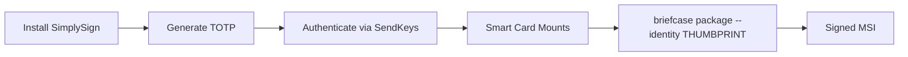

# Windows Code Signing with Certum SimplySign

Automate Certum SimplySign code signing in the GitHub Actions Windows build, replacing the current `--adhoc-sign` with a trusted certificate. Uses a **self-hosted Windows runner** (SimplySign requires an interactive desktop; GitHub-hosted runners run in Session 0 without one).

## Self-Hosted Runner Setup (One-Time)

The Windows build runs on your own machine so SimplySign can show its auth window and receive the TOTP via SendKeys.

### Add the runner to your repo

1. Go to **Settings > Actions > Runners** in your GitHub repo
2. Click **New self-hosted runner**
3. Select **Windows** and **x64**
4. Download and extract the runner
5. Run `config.cmd` — when asked "Configure as service?", answer **N** (we use interactive mode for SimplySign)
6. **Install SimplySign Desktop** on the runner machine (outside the runner folder). The workflow does not install it — use your existing installation.

### Run the runner in interactive mode (required)

**Important:** Run with `run.cmd`, **not** as a Windows service. Service mode uses Session 0, which has no interactive desktop.

```powershell
# In the runner folder (e.g. actions-runner\)
.\run.cmd
```

Keep the command window open while the runner is active. When you close it, the runner goes offline.

### Protect against fork access

1. **Repo Settings > Actions > General** — Enable **"Require approval for first-time contributors"** so workflow runs from new contributors need your approval before executing on your runner.
2. **Workflow safeguard** — The `build-windows` job has `if: github.repository == 'EazyTom/ableton-hub'`, so it only runs when the workflow is triggered from this repo, not from forks.
3. **No `pull_request` trigger** — This workflow runs only on `workflow_dispatch` and `push` (tags). Fork PRs cannot trigger it.

### When to run the runner

Start the runner **before** triggering a build:

- **Manual run:** Start runner → Actions → Build Installers → Run workflow
- **Tag push:** Start runner → Push your version tag (e.g. `v1.0.10`)

The Windows job will queue until your runner picks it up. You can stop the runner after the build completes.

## Architecture

SimplySign Desktop requires TOTP authentication to mount the cloud-based certificate as a virtual smart card. Once authenticated, `signtool.exe` (called internally by Briefcase) can access the certificate by its SHA-1 thumbprint. The authenticated session lasts ~2 hours -- more than enough for a CI build.



## Part 1: One-Time Local Setup (Manual)

These steps are performed once on your local machine before CI automation can work.

### 1A. Install and Activate SimplySign Desktop

- Download the installer: https://files.certum.eu/software/SimplySignDesktop/Windows/9.4.0.84/SimplySignDesktop-9.4.0.84-64-bit-en.msi
- Install and follow [Certum's activation guide](https://support.certum.eu/en/how-to-activate-access-to-simply-sign-application/) to link with the mobile app

### 1B. Extract the otpauth:// URI

During SimplySign activation, you scan a QR code with the mobile app. **Before scanning with the Certum app**, also scan it with a tool that reveals the raw URI:

- **Option A (1Password)**: Scan the QR code with 1Password's TOTP feature. Edit the entry and copy the full `otpauth://totp/...` URI.
- **Option B (QR reader app)**: Use any QR code scanner on your phone to read the raw text. It will look like:
  ```
  otpauth://totp/Certum?secret=ABCDEFG...&digits=6&period=30
  ```
- **Option C**: If you already scanned with the Certum app only, you may need to re-activate to see the QR code again (contact Certum support).

The critical value is `secret=...` inside the URI. This is the Base32-encoded TOTP seed that allows programmatic OTP generation, which is what enables headless CI authentication.

### 1C. Get the Certificate SHA-1 Thumbprint

After SimplySign is activated and connected:

1. Open `certmgr.msc` (Current User Certificate Manager)
2. Navigate to **Personal > Certificates**
3. Find your Certum code signing certificate
4. Double-click it, go to the **Details** tab, scroll to **Thumbprint**
5. Copy the 40-character hex string (e.g., `AABBCCDD11223344...`)

### 1D. Add GitHub Secrets

In the GitHub repository, go to **Settings > Secrets and variables > Actions** and add:

- `CERTUM_OTP_URI` -- The full `otpauth://totp/...` URI from step 1B
- `CERTUM_THUMBPRINT` -- The 40-character SHA-1 thumbprint from step 1C
- `CERTUM_EMAIL` -- Your SimplySign login email (the form prompts for Email then Token)

## Part 2: PowerShell Script (`scripts/Connect-SimplySign.ps1`)

A self-contained PowerShell script that automates SimplySign authentication on the CI runner. Based on the approach documented at [devas.life](https://www.devas.life/how-to-automate-signing-your-windows-app-with-certum/).

### What the script does

1. Parses `$env:CERTUM_OTP_URI` to extract the Base32 TOTP secret, digit count, and period
2. Generates the current TOTP code using inline C# (HMAC-SHA1 with time-based counter)
3. Launches SimplySign Desktop from the known install path
4. Uses `WScript.Shell` + `SendKeys` to type the OTP into the authentication window and press Enter
5. Polls `Cert:\CurrentUser\My` to verify the certificate with `$env:CERTUM_THUMBPRINT` becomes available

### Environment variables consumed

- `CERTUM_OTP_URI` -- the full otpauth:// URI
- `CERTUM_THUMBPRINT` -- used to verify the certificate mounted successfully

### Default SimplySign install path

After silent MSI install: `C:\Program Files (x86)\Certum\SimplySign Desktop\SimplySignDesktop.exe`

### TOTP generation (inline C#)

The script embeds a C# class that:
- Decodes the Base32 secret into a byte array
- Computes an HMAC-SHA1 hash using the current Unix time divided by the period (default 30s) as the counter
- Extracts a 6-digit (default) one-time password via dynamic truncation per RFC 6238

```powershell
Add-Type -Language CSharp @"
using System;
using System.Security.Cryptography;

public static class Totp
{
    private const string B32 = "ABCDEFGHIJKLMNOPQRSTUVWXYZ234567";

    private static byte[] Base32Decode(string s)
    {
        s = s.TrimEnd('=').ToUpperInvariant();
        int byteCount = s.Length * 5 / 8;
        byte[] bytes = new byte[byteCount];
        int bitBuffer = 0, bitsLeft = 0, idx = 0;
        foreach (char c in s)
        {
            int val = B32.IndexOf(c);
            if (val < 0) throw new ArgumentException("Invalid Base32 char: " + c);
            bitBuffer = (bitBuffer << 5) | val;
            bitsLeft += 5;
            if (bitsLeft >= 8)
            {
                bytes[idx++] = (byte)(bitBuffer >> (bitsLeft - 8));
                bitsLeft -= 8;
            }
        }
        return bytes;
    }

    public static string Now(string secret, int digits, int period)
    {
        byte[] key = Base32Decode(secret);
        long counter = DateTimeOffset.UtcNow.ToUnixTimeSeconds() / period;
        byte[] cnt = BitConverter.GetBytes(counter);
        if (BitConverter.IsLittleEndian) Array.Reverse(cnt);
        byte[] hash = new HMACSHA1(key).ComputeHash(cnt);
        int offset = hash[hash.Length - 1] & 0x0F;
        int binary =
            ((hash[offset] & 0x7F) << 24) |
            ((hash[offset + 1] & 0xFF) << 16) |
            ((hash[offset + 2] & 0xFF) << 8) |
            (hash[offset + 3] & 0xFF);
        int otp = binary % (int)Math.Pow(10, digits);
        return otp.ToString(new string('0', digits));
    }
}
"@
```

### SendKeys automation

```powershell
$wshell = New-Object -ComObject WScript.Shell
$focused = $wshell.AppActivate('SimplySign Desktop')

for ($i = 0; -not $focused -and $i -lt 10; $i++) {
    Start-Sleep -Milliseconds 500
    $focused = $wshell.AppActivate('SimplySign Desktop')
}

if (-not $focused) {
    throw "Could not bring SimplySign Desktop to the foreground."
}

Start-Sleep -Milliseconds 400
$wshell.SendKeys("$otp{ENTER}")
```

### Certificate verification loop

```powershell
for ($i = 0; $i -lt 30; $i++) {
    $cert = Get-ChildItem Cert:\CurrentUser\My |
            Where-Object { $_.Thumbprint -eq $env:CERTUM_THUMBPRINT }
    if ($cert) {
        Write-Host "Certificate found: $($cert.Subject)"
        exit 0
    }
    Start-Sleep -Seconds 2
}
throw "Certificate with thumbprint $env:CERTUM_THUMBPRINT not found after 60 seconds."
```

## Part 3: Workflow Changes

Modifications to `.github/workflows/build_installers.yml` in the `build-windows` job.

### Current state (untrusted)

```yaml
- name: Package as MSI
  run: briefcase package windows -p msi --adhoc-sign
```

### New steps (insert before packaging)

```yaml
- name: Install SimplySign Desktop
  run: |
    $url = "https://files.certum.eu/software/SimplySignDesktop/Windows/9.4.0.84/SimplySignDesktop-9.4.0.84-64-bit-en.msi"
    Invoke-WebRequest -Uri $url -OutFile "$env:RUNNER_TEMP\SimplySign.msi"
    Start-Process msiexec.exe -ArgumentList "/i `"$env:RUNNER_TEMP\SimplySign.msi`" /qn /norestart" -Wait

- name: Authenticate SimplySign
  env:
    CERTUM_OTP_URI: ${{ secrets.CERTUM_OTP_URI }}
    CERTUM_THUMBPRINT: ${{ secrets.CERTUM_THUMBPRINT }}
  run: powershell -ExecutionPolicy Bypass -File scripts/Connect-SimplySign.ps1
```

### Updated package step (signed)

```yaml
- name: Package as MSI (signed)
  run: briefcase package windows -p msi --identity "${{ secrets.CERTUM_THUMBPRINT }}"
```

Briefcase's `--identity` flag passes the thumbprint to `signtool.exe` internally, which signs both the application executable and the MSI installer.

## Risks and Mitigations

### SendKeys requires interactive desktop

GitHub-hosted Windows runners run in Session 0 (no interactive desktop), so SimplySign + SendKeys fails there. The workflow uses a **self-hosted runner** run with `run.cmd` (interactive mode), which has a real desktop. The script includes retry logic (10 attempts with 500ms delay) to handle slow window startup.

### TOTP timing

The TOTP is time-sensitive (30-second window by default). The script generates the code immediately before sending it, minimizing clock skew. GitHub-hosted runner clocks are NTP-synced so drift is negligible.

### SimplySign version pinning

The download URL is pinned to version `9.4.0.84`. If Certum deprecates this version, the workflow will fail at the download step -- easy to fix by updating the version string. Check for new versions at: https://files.certum.eu/software/SimplySignDesktop/Windows/

### SimplySign auth window variants

The script supports:
- **Email + Token form**: Set `CERTUM_EMAIL` secret. Script sends email, Tab, OTP, Enter.
- **Token-only form**: Omit `CERTUM_EMAIL`. Script sends OTP, Enter.
- **Dynamic window discovery**: Finds the login window by process `MainWindowTitle` or by known partial titles (SimplySign, Certum, Sign in, Login).
- **Retry**: If the certificate doesn't mount, the script retries the credential send once.

### Fallback behavior

The workflow should **never** silently fall back to ad-hoc signing. If SimplySign authentication or signing fails, the job must fail explicitly so untrusted builds are never accidentally released.

### SmartScreen "Windows protected your PC" warning

Even with valid Certum signing, SmartScreen can show "unrecognized app" for new releases. SmartScreen uses **reputation**, not just "is it signed?" — new apps must build trust over time.

**What you can do:**

1. **Submit to Microsoft** — Go to [Microsoft Security Intelligence](https://www.microsoft.com/en-us/wdsi/filesubmission), sign in, choose "Submit a file for analysis", select your MSI, and choose "Software Developer" as the submission type. This can speed up reputation establishment.

2. **Use Certum timestamp** — The workflow uses `--timestamp-url http://time.certum.pl` so signatures remain valid after the cert expires. This is required for long-term trust.

3. **Reputation over time** — As more users download and run the signed installer, SmartScreen warnings typically diminish. There is no fixed timeframe; it depends on download volume and Microsoft's algorithms.

Users can still install: click "More info" → "Run anyway". The signature is valid; SmartScreen is only flagging low reputation.

### Troubleshooting

| Symptom | Fix |
|--------|-----|
| "Could not activate SimplySign" | Run the runner with `run.cmd` (not as a service). Check the debug output for visible window titles. |
| "Certificate not found after 2 attempts" | Ensure `CERTUM_EMAIL` matches your SimplySign login. If the form has Token first, try omitting `CERTUM_EMAIL` and see if token-only works. |
| SimplySign shows but keys don't type | The script stops existing SimplySign and restarts it for a fresh login. Ensure no other app steals focus. |
| Cert already mounted | The script skips auth if the cert is present. Stop SimplySign and re-run to force fresh auth. |

## Files

- **New**: `scripts/Connect-SimplySign.ps1` -- TOTP generation + SimplySign authentication + certificate verification
- **Modified**: `.github/workflows/build_installers.yml` -- SimplySign install, auth, and signed packaging in the `build-windows` job

## References

- [Automating SimplySign (devas.life)](https://www.devas.life/how-to-automate-signing-your-windows-app-with-certum/)
- [Briefcase Windows Code Signing](https://briefcase.beeware.org/en/v0.3.16/how-to/code-signing/windows.html)
- [SimplySign Silent Install (ManageEngine)](https://www.manageengine.com/products/desktop-central/software-installation/silent_install_ProCertum-SmartSign-SimplySign-Desktop-(MSI)-(x64)-(9.4.0.84).html)
- [Certum SimplySign Activation Guide](https://support.certum.eu/en/how-to-activate-access-to-simply-sign-application/)
- [Certum Software Downloads](https://support.certum.eu/en/cert-offer-software-and-libraries/)
